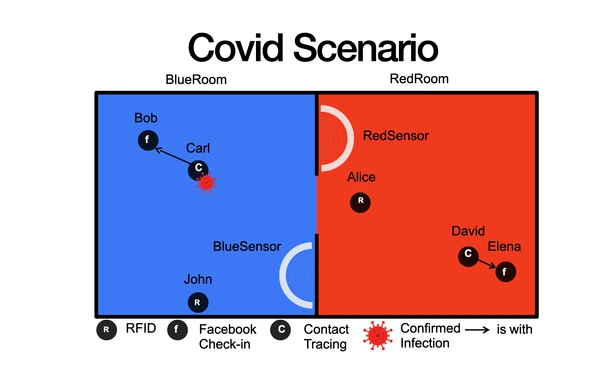
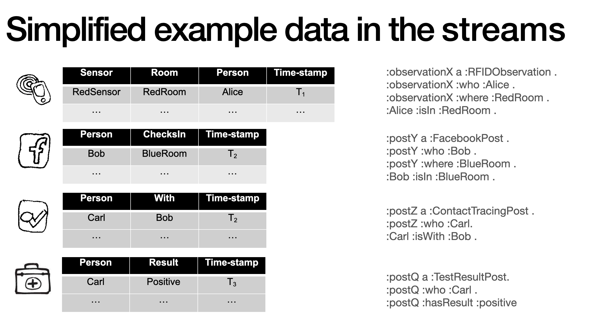
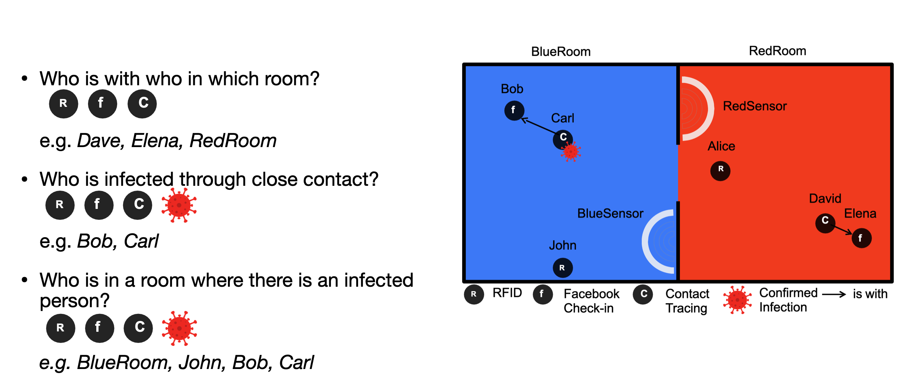

# RSP4J @ IEEE Big Data 2021 

This repository contains the examples and exercises for the RSP4J tutorial at IEEE Big Data 2021.

We will use a covid scenario consisting of two room (BlueRoom and RedRoom) and 4 types of streams:
1. RFID observations that report the location of a person through RFID tags.
1. Facebook check-in posts that also report the location of a person.
1. Contact tracing posts that report the presence of two individuals.
1. Testing results posts that report the results of a corona test a certain individual took.

The figure below shows the setup of the corona scenario.
 

Each of the streams typically come in a variaty of data formats (e.g. json, csv, xml, etc.). 
For simplicty, we show them here in tabular format and how they are mapped to the semantic model:

 

During the examples and exercises, we will look at solving the following queries:
 

# RSP4J

RSP4J is an API for the development of RSP engines. More information can be found on the [RSP4J website](https://github.com/streamreasoning/rsp4j).
We welcome any kind of contribution, please check the [contribution document](https://github.com/streamreasoning/rsp4j/blob/master/CONTRIBUTING.md) for more information.
